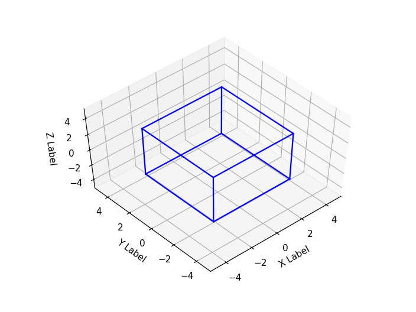

# Expert System
## Assignment 1 - [Task 2: 3D Rotation]
***
### Mohammad Riza Farhandhy - 1313617038
***


```python
%matplotlib notebook

import numpy as np
import matplotlib.pyplot as plt
from mpl_toolkits.mplot3d import axes3d
from itertools import product, combinations

fig = plt.figure()
ax = fig.add_subplot(111, projection='3d')

r = [-3, 3]
for s, e in combinations(np.array(list(product(r, r, r))), 2):
   if np.sum(np.abs(s-e)) == r[1]-r[0]:
       ax.plot3D(*zip(s, e), color="b")

ax.set_xlabel('X Label')
ax.set_ylabel('Y Label')
ax.set_zlabel('Z Label')
ax.set_xlim3d(-5, 5)
ax.set_ylim3d(-5, 5)
ax.set_zlim3d(-5, 5)

plt.show()
```





```python
# still dont understand how to plot 3d properly...
```


```python

```
