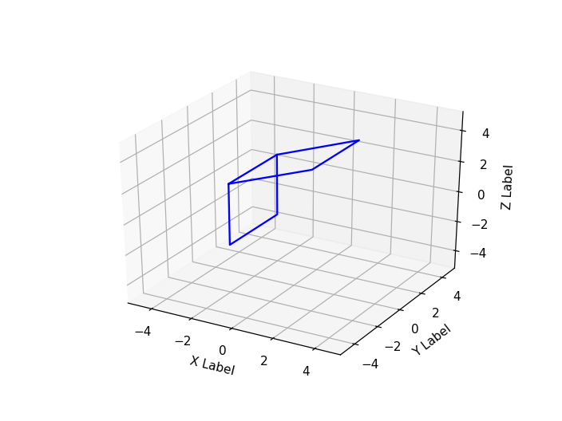

# Expert System
## Assignment 1 - [Task 2: 3D Rotation]
***
### Mohammad Riza Farhandhy - 1313617038
***


```python
%matplotlib notebook

import numpy as np
import matplotlib.pyplot as plt
from mpl_toolkits.mplot3d import axes3d
from mpl_toolkits.mplot3d.art3d import Poly3DCollection, Line3DCollection
from itertools import product, combinations

fig = plt.figure()
ax = fig.add_subplot(111, projection='3d')

# r = [-3, 3]
# for s, e in combinations(np.array(list(product(r, r, r))), 2):
#    if np.sum(np.abs(s-e)) == r[1]-r[0]:
#        ax.plot3D(*zip(s, e), color="b")

# m = [
#     [-2, -2, 2],
#     [-2, 2, 2],
#     [2, 2, 4],
#     [2, -2, 4],
#     [-2, -2, 2],
#     [-2, -2, -2],
#     [-2, 2, -2],
#     [-2, 2, 2]
# ]

x = [-2, -2, 2, 2, -2, -2, -2, -2]
y = [-2, 2, 2, -2, -2, -2, 2, 2]
z = [2, 2, 4, 4, 2, -2, -2, 2]

ax.plot3D(x, y, z, color="b")

ax.set_xlabel('X Label')
ax.set_ylabel('Y Label')
ax.set_zlabel('Z Label')
ax.set_xlim3d(-5, 5)
ax.set_ylim3d(-5, 5)
ax.set_zlim3d(-5, 5)

plt.show()
```





```python
# still dont understand how to plot 3d properly and how to manipulate the matrix......
```


## Euler Angles

A 3D Rotation that provides three rotations based on the XYZ axes of coordinate system.
```
x-axis rotation matrix
    [[  1     0     0  ]
     [  0    cosθ -sinθ]
     [  0    sinθ  cosθ]]
     
y-axis rotation matrix
    [[cosθ    0    sinθ]
     [  0     1     0  ]
     [-sinθ   0    cosθ]]
     
z-axis rotation matrix
    [[cosθ  -sinθ   0  ]
     [sinθ   cosθ   0  ]
     [  0     0     1  ]]
```

